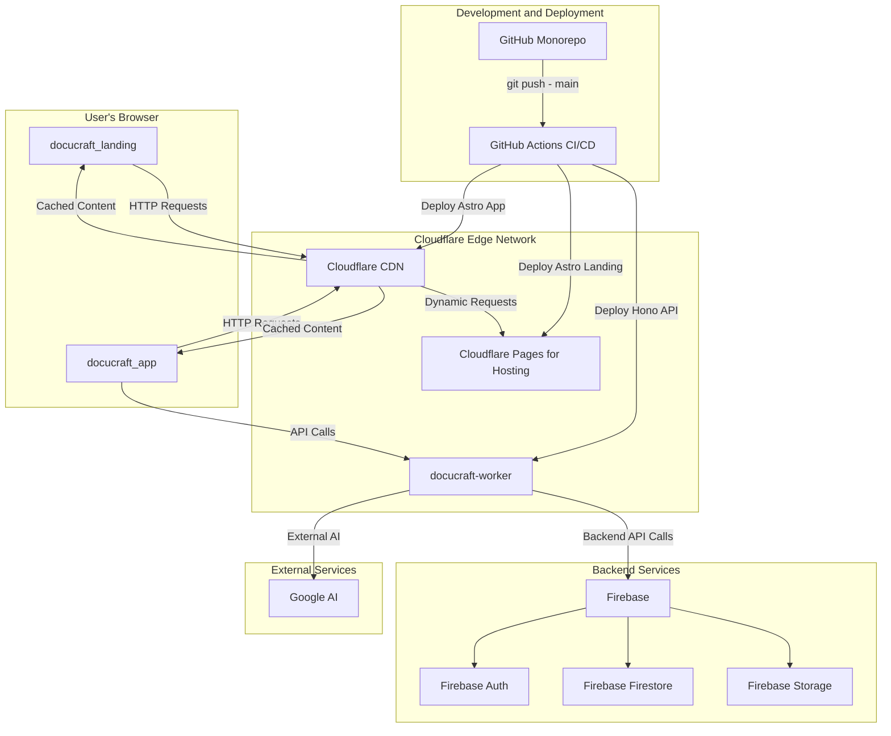

# **Project DocuCraft: Technical Report & Deployment Strategy**

_Last Updated: July 22, 2025_

---

## **1. Executive Summary**

This report outlines the technical architecture, deployment strategy, and cost analysis for the **DocuCraft** project, which is managed as a monorepo containing three distinct applications.

The chosen solution leverages a modern, serverless architecture to deliver a high-performance, secure, and scalable user experience. By utilizing **Cloudflare** for hosting and serverless functions and **Firebase (Firestore)** as the backend, we achieve global low latency, maximize performance, and introduce advanced AI capabilities, all while maintaining a cost-effective operational footprint.

**Key Highlights:**

- **Global CDN:** Sub-second load times worldwide via Cloudflare's Edge Network.
- **Serverless AI:** Advanced AI features implemented securely through Cloudflare Workers.
- **Automated Deployments:** A robust CI/CD pipeline ensures rapid and reliable updates.
- **Cost-Effective:** Annual operational costs are minimized by leveraging generous free tiers and pay-as-you-go pricing.

---

## **2. System Architecture**

The application is designed as a monorepo containing three separate projects, all leveraging a shared serverless infrastructure to ensure scalability and performance.

### **2.1. Project Breakdown**

- **`docucraft_landing`**: A static, fast-loading marketing and landing page built with **Astro**.
- **`docucraft-app`**: A Server-Side Rendered (SSR) application built with **Astro**, providing a dynamic and interactive user experience.
- **`docucraft-worker`**: A serverless API built with **Hono** on Cloudflare Workers, handling backend logic and communication with AI services.

### **2.2. Technology Stack**

- **Frontend & SSR:** Astro (`docucraft_landing`, `docucraft-app`).
- **Hosting & CDN:** Cloudflare Pages.
- **Serverless API:** Hono on Cloudflare Workers (`docucraft-worker`).
- **Backend-as-a-Service (BaaS):** Firebase (Firestore, Authentication, and Storage).
- **CI/CD:** GitHub Actions.

### **2.3. Architectural Diagram**

_This diagram illustrates the flow of data from the user through the different project frontends to our backend services._

---

## **3. Continuous Deployment (CI/CD)**

### **3.1. How Changes Go to Production**

New changes are deployed to production automatically. The process is simple, secure, and efficient:

1.  A developer pushes a new commit to the `main` branch of the GitHub repository.
2.  This push automatically triggers a predefined **GitHub Actions** workflow.

### **3.2. CI/CD Flow**

The GitHub Actions workflow is triggered on a push to the `main` branch and intelligently builds and deploys only the projects that have changed:

1.  **Build:** It builds the Astro applications (`docucraft_landing` and `docucraft-app`).
2.  **Test:** It runs automated tests, including **Core Web Vitals** checks for the landing site to ensure high performance.
3.  **Deploy:** It securely deploys the built applications to **Cloudflare Pages** and the serverless API to **Cloudflare Workers**.

This entire process is seamless, requiring no manual intervention, and deployments are atomic, meaning the site is never in a broken state.

---

## **4. Justification of Chosen Services**

*(Note: For context on why these detailed justifications are included, please see Section 8: Author's Note.)*

The technology stack was chosen to meet the core requirements: low latency, high performance, advanced serverless functionality, and cost control.

### **4.1. Why Astro for the Frontend (Over Flutter)**

The decision to build the `docucraft-app` with Astro instead of Flutter was driven by a critical feature requirement: the need to natively render complex `Mermaid.js` diagrams.

-   **Native Web Compatibility:** Astro, as a web-native framework, integrates seamlessly with JavaScript libraries like Mermaid.js. This ensures reliable rendering, performance, and access to the full feature set of the library.
-   **Addressing Flutter Web's Limitations:** While Flutter for Web is powerful for creating cross-platform UIs, it renders its own view using a canvas (`canvaskit`). This can create compatibility and performance challenges when integrating with JavaScript libraries that heavily manipulate the DOM, such as Mermaid.js. The switch to Astro mitigates these risks and ensures a core feature of the application works flawlessly.

### **4.2. Why Cloudflare (Pages & Workers)?**

-   **Rapid Development:** As a Backend-as-a-Service (BaaS), Firebase provides pre-built, highly scalable components for authentication, a NoSQL database (Firestore), and file storage. This drastically reduces development time.
-   **Excellent Serverless Integration:** The Firebase Admin SDKs are well-supported and can be used within Cloudflare Workers, enabling secure and efficient communication between our serverless API and backend.
- **Performance & Latency:** Cloudflare Pages serves the website content from its vast global network of data centers, ensuring that users anywhere in the world experience the fastest possible load times. This is ideal for both the static `docucraft-landing` and the SSR `docucraft-app`.
- **Integrated Serverless:** Cloudflare Workers allows us to run server-side code (like AI model inference) at the edge. This is significantly faster than traditional server-based APIs because the code runs closer to the user, reducing network latency.
- **Security:** Cloudflare provides industry-leading DDoS protection and a Web Application Firewall (WAF) out-of-the-box.
- **Cost:** The free tier is incredibly generous, and the pay-as-you-go pricing for Workers and other services is highly competitive.

### **4.3. Why Firebase (Over Supabase)**

-   **Faster Iteration with NoSQL:** The project's data structures are expected to evolve. Firebase's NoSQL database (Firestore) allows for flexible, schema-less data modeling, enabling faster development iterations compared to a relational database like PostgreSQL (used by Supabase).
-   **Seamless Astro Integration:** Firebase has excellent and straightforward integration with Astro, reducing the complexity and time required to connect the frontend application to the backend.
-   **Real-time Capabilities:** Firestore offers powerful real-time data synchronization out-of-the-box, which is ideal for building dynamic and interactive features in the `docucraft-app`.
-   **Scalability and Reliability:** As a Google Cloud product, Firebase is built to scale automatically and offers high reliability, ensuring the backend can handle significant user load without manual intervention.

---

## **5. Annual Cost Analysis**

This projection is based on the pricing models of our chosen services. The architecture is designed to be highly cost-effective, primarily operating within the free tiers initially.

| Service                | Free Tier Allowance                                       | Estimated Annual Cost (Beyond Free Tier)   |
| ---------------------- | --------------------------------------------------------- | ------------------------------------------ |
| **Cloudflare Pages**   | 1 concurrent build, 500 builds/month                      | **$0** (Free tier is sufficient)           |
| **Cloudflare Workers** | 100,000 requests/day                                      | **$0 - $60** / year ($5/mo per 10M reqs)   |
| **Firebase**           | Generous free tier for DB, Auth, and Storage reads/writes | **$0 - $300** / year ($25/mo for Blaze plan) |
| **GitHub Actions**     | 2,000 CI/CD minutes/month (for public repos)              | **$0** (Free tier is sufficient)           |
| **TOTAL**              |                                                           | **~$0 - $360 / year**                      |

**Conclusion:** The total annual cost to keep the website online is projected to be between **$0 and $360**. Costs will only be incurred if the application's usage grows significantly beyond the generous free tiers provided by Cloudflare and Firebase.

---

## **6. Performance & Reporting**

To ensure the website remains fast and reliable, we will continuously monitor its performance using the following industry-standard tools.

### **6.1. Core Web Vitals**

These metrics measure real-world user experience for loading performance, interactivity, and visual stability.

- **Source:** We will use [Google PageSpeed Insights](https://pagespeed.web.dev/) and Cloudflare's built-in analytics to track these metrics.
- **Reports:** Regular reports will be generated to identify and address any performance bottlenecks.

### **6.2. New Relic**

For more in-depth application performance monitoring (APM), we can integrate New Relic.

- **Functionality:** New Relic can provide detailed transaction traces, error tracking, and infrastructure monitoring for our Cloudflare Workers and backend services.
- **Benefit:** This allows for proactive issue detection and deep-dive analysis to resolve complex problems before they impact users.

---

## **7. Project Status**

**Under Development:** All three projects within this monorepo (`docucraft_landing`, `docucraft-app`, and `docucraft-worker`) are currently under active development.

---

## **8. Author's Note**

This document is intentionally detailed to serve as a comprehensive technical reference and a "single source of truth" for the project's architecture and decision-making process.

My primary background is in developing applications with Flutter, Firebase, and the Google Cloud Platform (GCP). The exploration into technologies like Astro, Hono, and Cloudflare Workers represents a deliberate effort to leverage the best tools for the specific needs of this project, even when they are outside my typical stack. The detailed justifications are therefore a way to transparently document the reasoning behind these technology choices for all stakeholders, including myself.